Bài toán người bán hàng du lịch sử dụng Branch and Bound
Với một tập hợp các thành phố và khoảng cách giữa mỗi cặp thành phố, bài toán đặt ra là tìm ra tuyến đường ngắn nhất có thể đi qua mỗi thành phố đúng một lần và quay trở lại điểm xuất phát.

Ví dụ, hãy xem xét biểu đồ sau . Một chuyến tham quan TSP trong biểu đồ là A —> B —> C —> D —> B —> A. Chi phí của chuyến tham quan là 10 + 25 + 40 + 25 + 10 = 100.

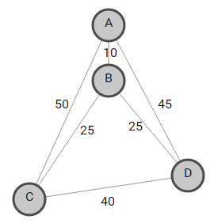

Bài viết này thảo luận về Bài toán người bán hàng du lịch sử dụng Branch and Bound.

 Thuật ngữ Branch and Bound đề cập đến tất cả các phương pháp tìm kiếm không gian trạng thái trong đó tất cả các con của một E–node được tạo ra trước khi bất kỳ nút sống nào khác có thể trở thành E–node. E–node là nút đang được mở rộng. Cây không gian trạng thái có thể được mở rộng theo bất kỳ phương pháp nào, tức là BFS hoặc DFS . Cả hai đều bắt đầu bằng nút gốc và tạo ra các nút khác. Một nút đã được tạo ra và các con của nó chưa được mở rộng được gọi là nút sống. Một nút được gọi là nút chết, đã được tạo ra, nhưng không thể mở rộng thêm nữa. Trong phương pháp này, chúng ta mở rộng nút hứa hẹn nhất, nghĩa là nút hứa hẹn rằng việc mở rộng hoặc chọn nó sẽ cung cấp cho chúng ta giải pháp tối ưu. Vì vậy, chúng ta chuẩn bị cây bắt đầu từ gốc và sau đó mở rộng nó.

Chúng ta có ma trận chi phí được xác định bởi:

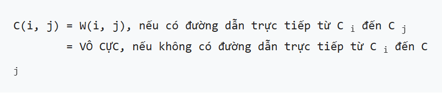

Ví dụ, hãy xem xét ma trận chi phí sau M:

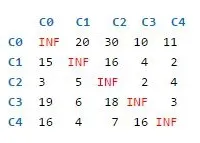

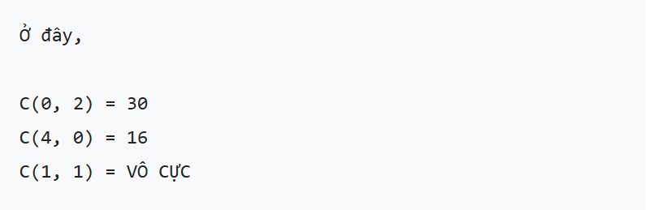

Sau đây là cây không gian trạng thái cho bài toán TSP ở trên, trong đó hiển thị giải pháp tối ưu được đánh dấu màu xanh lá cây:

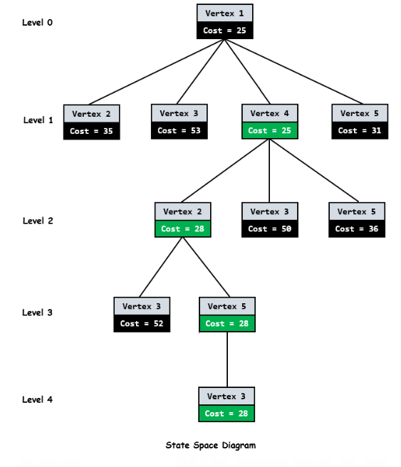

Như chúng ta có thể thấy từ sơ đồ trên, mỗi nút đều có chi phí liên quan đến nó. Khi chúng ta đi từ thành phố này isang thành phố khác j, chi phí của một nút jsẽ là tổng của nút cha i, chi phí của một cạnh (i, j)và giới hạn dưới của đường dẫn bắt đầu tại nút j.

Vì nút gốc là nút đầu tiên được mở rộng nên nó không có nút cha nào. Vì vậy, chi phí sẽ chỉ là giới hạn dưới của đường dẫn bắt đầu từ gốc.

Bây giờ, làm thế nào để tính toán giới hạn dưới của đường dẫn bắt đầu từ bất kỳ nút nào?

Nói chung, để có được giới hạn dưới của đường dẫn bắt đầu từ nút, chúng ta giảm từng hàng và cột sao cho phải có ít nhất một số không trong mỗi hàng và cột. Chúng ta cần giảm giá trị nhỏ nhất từ ​​mỗi phần tử trong mỗi hàng và cột.

Chúng ta hãy bắt đầu từ nút gốc.

Chúng tôi giảm giá trị tối thiểu trong mỗi hàng từ mỗi phần tử trong hàng đó. Giá trị tối thiểu trong mỗi hàng của ma trận chi phí Mđược đánh dấu bằng màu xanh [10 2 2 3 4]bên dưới.

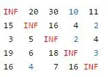

Sau khi rút gọn hàng, ta thu được ma trận rút gọn như bên dưới.

Sau đó, chúng ta giảm giá trị tối thiểu trong mỗi cột từ mỗi phần tử trong cột đó. Giá trị tối thiểu trong mỗi cột được đánh dấu bằng màu xanh lam [1 0 3 0 0]. Sau khi giảm cột, chúng ta sẽ có được ma trận đã giảm bên dưới. Ma trận này sẽ được các nút con của nút gốc xử lý thêm để tính toán giới hạn dưới của chúng.

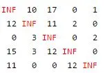

Tổng chi phí dự kiến ​​tại nút gốc là tổng của tất cả các phép giảm.

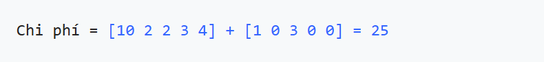

Vì chúng ta đã khám phá ra nút gốc C0, nút tiếp theo cần mở rộng có thể là bất kỳ nút nào từ C1, C2, C3, C4. Bất kỳ nút nào có chi phí tối thiểu sẽ được mở rộng thêm. Vì vậy, chúng ta phải tìm ra chi phí mở rộng của mỗi nút.

Nút cha C0có ma trận thu gọn bên dưới:

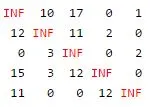

Chúng ta hãy xem xét một cạnh từ 0 —> 1.

1. Khi chúng ta thêm một cạnh (0, 1)vào không gian tìm kiếm của mình, hãy đặt các cạnh đi ra cho thành phố 0thành INFINITYvà tất cả các cạnh đến thành phố 1thành INFINITY. Chúng tôi cũng đặt (1, 0)thành INFINITY.

Vì vậy, trong ma trận thu gọn của nút cha, hãy thay đổi tất cả các phần tử trong hàng 0, cột 1và tại chỉ mục (1, 0)thành INFINITY(được đánh dấu màu đỏ).

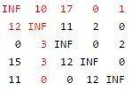

Ma trận chi phí kết quả là:

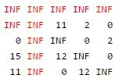

2. Chúng tôi cố gắng tính toán giới hạn dưới của đường dẫn bắt đầu tại nút 1bằng cách sử dụng ma trận chi phí kết quả ở trên. Giới hạn dưới là 0ma trận đã ở dạng thu gọn, tức là tất cả các hàng và tất cả các cột đều có giá trị bằng không.

Do đó, đối với nút 1, chi phí sẽ là:

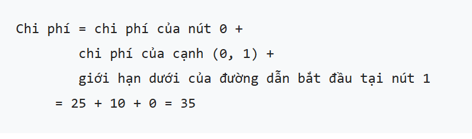

Chúng ta hãy xem xét một cạnh từ0 —> 2

1. Thay đổi tất cả các phần tử trong hàng 0, cột 2và chỉ mục (2, 0)thành INFINITY(được đánh dấu màu đỏ).

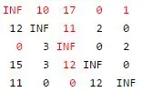

Ma trận chi phí kết quả là:

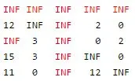

2. Bây giờ hãy tính toán giới hạn dưới của đường dẫn bắt đầu tại nút 2bằng cách sử dụng phương pháp đã thảo luận trước đó. Ma trận kết quả sẽ là:

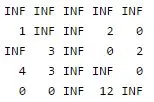

Do đó, đối với nút 2, chi phí sẽ là

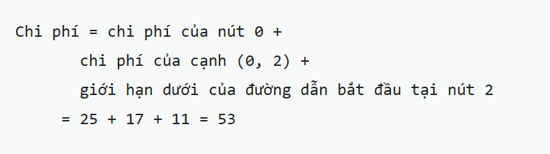

Chúng ta hãy xem xét một cạnh từ 0 —> 3.

1. Thay đổi tất cả các phần tử trong hàng 0, cột 3và chỉ mục (3, 0)thành INFINITY(được đánh dấu màu đỏ).

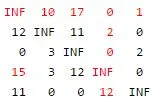

Ma trận chi phí kết quả là:

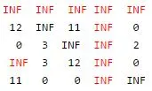

2. Bây giờ hãy tính toán giới hạn dưới của đường dẫn bắt đầu tại nút 3bằng cách sử dụng phương pháp đã thảo luận trước đó. Giới hạn dưới của đường dẫn bắt đầu tại nút 3là 0như nó đã ở dạng rút gọn, tức là tất cả các hàng và tất cả các cột đều có giá trị bằng không.

Do đó, đối với nút 3, chi phí sẽ là

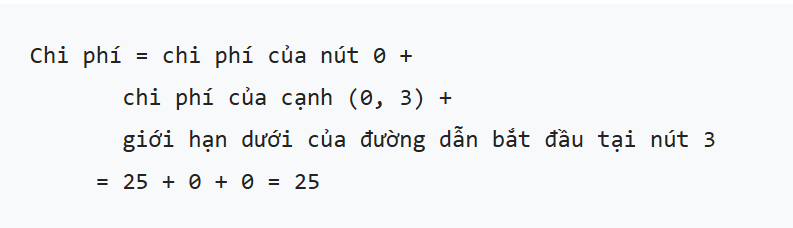

Tương tự như vậy, chúng ta tính toán chi phí của 0 —> 4. Chi phí của nó sẽ là 31.

Bây giờ hãy tìm một nút sống có chi phí ước tính nhỏ nhất. Các nút sống 1, 2, 3, và 4có chi phí lần lượt 35là , 53, 25, và 31. Nút nhỏ nhất trong số chúng là nút 3, có chi phí 25. Vì vậy, nút 3sẽ được mở rộng hơn nữa, như thể hiện trong sơ đồ cây không gian trạng thái. Sau khi thêm các nút con của nó vào danh sách các nút sống, hãy tìm một nút sống có chi phí nhỏ nhất và mở rộng nút đó. Tiếp tục tìm kiếm cho đến khi gặp một lá trong cây tìm kiếm không gian. Nếu gặp một lá, thì chuyến tham quan đã hoàn tất và chúng ta sẽ quay lại nút gốc.